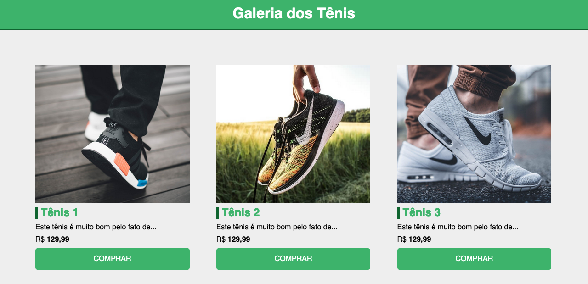

# CSS Hora de Codar - Sneakers Sales Website

This is a simple website coded with only HTML and CSS.

It's is my personal version of the [original project](https://www.youtube.com/watch?v=vwbegraDXD8) from the YouTube channel [Matheus Battisti - Hora de Codar](https://www.youtube.com/@MatheusBattisti).

## Table of contents

- [Overview](#overview)
  - [Screenshot](#screenshot)
  - [Links](#links)
- [My process](#my-process)
  - [Built with](#built-with)
  - [What I learned](#what-i-learned)
  - [Continued development](#continued-development)
  - [Useful resources](#useful-resources)
- [Author](#author)

## Overview

### Screenshot



### Links

- Live Site URL: [https://expertiner.github.io/css_fundamentos/](https://expertiner.github.io/css_fundamentos/)


## My process

### Built with

- Semantic HTML5 markup

### What I learned

- How to fork a repository on GitHub.
- Tag class shortcut.
  >`tag.classname#idname` + `tab`
- Change occurences on siblings.
  >`cmd` + `d`
- How to use a CSS reset.
  >```css
  >* {
  >  padding: 0;
  >  margin: 0;
  >  box-sizing: border-box;
  >  font-family: Helvetica, sans-serif;
  >}
  >```
- The css property `transition`.

### Continued development

- Concepts I'm still not completely comfortable with:
  - The css property and value `box-sizing: border-box`.

- Techniques I want to refine and perfect:
  -  CSS Box Model.

### Useful resources

- [Curso gratuito Git e Github #15 - Fazendo Fork de um repositório](https://www.youtube.com/watch?v=n_GEGPuNNRA&t=141s) - This helped me at forking a repository on GitHub.

- [Aprenda tudo sobre positions do CSS em 25 minutos](https://www.youtube.com/watch?v=kEBrkPNv4Zk) - This helped me at understanding better the `position` css property and its values, specially `relative` and `absolute`.

<!--
- [Example resource 1](https://www.markdownguide.org/basic-syntax/) - This helped me for XYZ reason. I really liked this pattern and will use it going forward.
- [Example resource 2](https://www.example.com) - This is an amazing article which helped me finally understand XYZ. I'd recommend it to anyone still learning this concept.
-->

## Author

- GitHub - [Andrey Alves](https://github.com/Expertiner)

- Frontend Mentor - [@expertiner](https://www.frontendmentor.io/profile/Expertiner)
<!--
- Twitter - [@yourusername](https://www.twitter.com/yourusername)
-->

<!-- ## Acknowledgments -->

<!-- Got some inspiration from the Frontend Mentor Discord's Server. -->

<!--
This is where you can give a hat tip to anyone who helped you out on this project. Perhaps you worked in a team or got some inspiration from someone else's solution. This is the perfect place to give them some credit.

**Note: Delete this note and edit this section's content as necessary. If you completed this challenge by yourself, feel free to delete this section entirely.**
-->